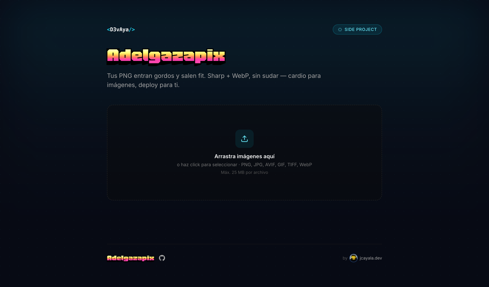

# Adelgazapix

> Tus PNG entran gordos y salen fit. Sharp + WebP, sin sudar — cardio para imágenes, deploy para ti.



App liviana para que un equipo (o tú mismo) suba imágenes desde el navegador, las procese con **Sharp** en el servidor y descargue WebP optimizado: una a una o todo en un ZIP.

Construido con Next.js 16 (App Router) + React 19 + Sharp 0.33 + Tailwind 3 + TypeScript. Pensado para correr en Vercel (Fluid Compute) sin configuración adicional, o local con `npm run dev`.

---

## Features

- **Drag & drop** + selector múltiple, todos los archivos en paralelo.
- **Per-file feedback**: estado por archivo (queued → uploading con %, processing, done, error) + barra global.
- **Dual upload path**: archivos ≤ 4 MB van multipart directo; > 4 MB van via Vercel Blob (saltea el límite de 4.5 MB de las Vercel Functions).
- **Descarga individual** (.webp) o **batch como .zip** (JSZip via dynamic import, no infla el bundle inicial).
- **Sharp WebP** con `quality` y `effort` máximos por defecto. Rotación EXIF + `smartSubsample`.
- **API limpia** (`POST /api/process`) con error envelope consistente y status codes semánticos.
- **Branding centralizado**: un único archivo (`branding.config.ts`) controla copy, logo, paleta, fuentes, límites, MIME aceptados.
- **Production hardening opt-in** vía env vars: Basic Auth, Origin allowlist con auto-detección de URLs Vercel, rate limit con Upstash Redis, cleanup de orphan blobs.
- **Security headers**: CSP estricta, HSTS en prod, X-Frame-Options, Permissions-Policy, X-Content-Type-Options.
- **A11y**: focus rings, ARIA labels, `prefers-reduced-motion`, keyboard navigation.

---

## Arranque rápido

```bash
git clone https://github.com/D3vaya/adelgazapix.git
cd adelgazapix
npm install
npm run dev
# → http://localhost:3000
```

Deploy a Vercel:

```bash
npm i -g vercel        # si no lo tienes
vercel deploy          # preview
vercel deploy --prod   # producción
```

En local sin configuración adicional funciona "abierto" (sin auth, sin rate limit, sin blob — el límite es solo `maxFileBytes` de tu config, 25 MB por defecto).

Para prod **necesitas** mínimo: crear un Blob store en Vercel (para archivos > 4 MB) y opcionalmente activar el resto de protecciones (ver [Production hardening](#production-hardening)).

---

## Customizar para tu equipo o marca

**Toda la personalización vive en un solo archivo: [`branding.config.ts`](./branding.config.ts).**

Después de cualquier cambio, reinicia `npm run dev`.

### 1. Nombre, copy y enlaces

```ts
brand: {
  name: "<D3vAya/>",                          // wordmark del header (si lleva <…/> se estiliza como código)
  product: "Adelgazapix",                     // título grande en Honk
  productHref: "https://github.com/...",      // opcional: hace clickable el título → repo
  tagline: "...",                             // descripción debajo del título
  badge: "side project",                      // chip en la esquina superior derecha
  footer: {
    right: "jcayala.dev",                     // texto a la derecha del footer
    rightHref: "https://www.jcayala.dev/",    // opcional: hace clickable la firma
    signaturePrefix: "by",                    // opcional: prefijo ("by", "—", "made by")
  },
  locale: "es",                               // <html lang="...">
}
```

Si dejas `productHref` o `rightHref` como `undefined`, el link no se renderiza.

### 2. Logo / firma

Pon tu imagen en `public/` y referénciala:

```ts
logo: {
  src: "/sign.png",
  alt: "D3v",
  width: 48, height: 48,
  header: {
    show: false,                              // true para wordmarks (estilo WOM)
    className: "h-7 w-auto",
  },
  footer: {
    show: true,                               // true para avatares (estilo firma)
    className: "h-5 w-5 shrink-0 rounded-full object-cover ring-1 ring-brand-500/30",
  },
}
```

- **Wordmark horizontal** (logo corporativo): `header.show: true`, `footer.show: false`.
- **Avatar redondo** (firma personal): `header.show: false`, `footer.show: true`.

### 3. Paleta

Pasa la escala completa 50→950 en hex. La forma más rápida: ve a [uicolors.app/create](https://uicolors.app/create), elige tu color base, copia los 11 valores.

```ts
palette: {
  50: "#ecfeff",  100: "#cffafe", 200: "#a5f3fc", 300: "#67e8f9",
  400: "#22d3ee", 500: "#06b6d4", 600: "#0891b2", 700: "#0e7490",
  800: "#155e75", 900: "#164e63", 950: "#083344",
}
surface: {
  background: "#070a14",                      // fondo de página
  foreground: "#e8f4ff",                      // color principal de texto
}
```

Los colores se exponen como CSS variables (`--brand-50` … `--brand-950`) y Tailwind las consume como `bg-brand-500`, `text-brand-300`, `border-brand-500/20`, etc., **con soporte de opacidad incluido**.

### 4. Tipografía

Las fuentes se cargan via [`next/font/google`](https://nextjs.org/docs/app/api-reference/components/font) en `app/layout.tsx`. Por defecto:

- `Inter` para el body (sans-serif neutra).
- `Honk` para el título del producto (variable font arcade/expresiva).

Para cambiar la fuente del título: edita el import en `app/layout.tsx`, crea el loader con `variable: "--font-display"`, añade la variable al `<html>`, y deja `tailwind.config.ts` → `fontFamily.display` apuntando a esa variable.

### 5. Procesamiento

```ts
processing: {
  quality: 75,             // WebP quality 1–100
  effort: 6,               // 0–6 (más alto = más lento + más pequeño)
  maxFileBytes: 25 * 1024 * 1024,
  maxFiles: 100,           // cap por sesión en el cliente
  maxConcurrent: 4,        // uploads simultáneos
  maxDimension: 12000,     // rechaza imágenes más grandes (HTTP 422)
  allowedMime: ["image/png", "image/jpeg", ...],
}
```

Los mismos valores se importan en el cliente (`components/Uploader.tsx`) y el servidor (`app/api/process/route.ts` + `app/api/upload/route.ts`).

> **Tip de performance**: si tus usuarios se cansan de esperar imágenes grandes, baja `effort` de 6 a 4 — encoding **~2.5× más rápido** con apenas 3–5% más de peso. El default Sharp es 4.

---

## Production hardening

Un endpoint público que corre Sharp es un blanco fácil para abuso (CPU bombs, hotlinking, scraping). Todas las protecciones son **opt-in** vía env vars. Sin configurarlas, la app sigue funcionando.

### Capa 0 — En Vercel dashboard (zero código, haz esto sí o sí)

| Acción | Dónde | Por qué |
|---|---|---|
| **Spend cap** | Settings → Billing → Spend Management | Límite duro en USD. Si lo superas, la app se pausa en vez de seguir cobrando. |
| **Usage alerts** | Settings → Billing → Notifications | Notificación a 50/80/100 % del cap. |
| **WAF Rate Limit** | Project → Firewall → Rate Limit | Regla simple: 10 req/min/IP en `/api/process`. Gratis hasta cuota. |
| **Vercel BotID** | Project → Firewall → BotID | Bloqueo automático de bots no humanos. |
| **Attack Mode** | Project → Firewall (toggle) | Switch de emergencia con challenge global. |

### Capa 1 — Vercel Blob (REQUERIDO para archivos > 4 MB)

Vercel rechaza cualquier body > 4.5 MB con `FUNCTION_PAYLOAD_TOO_LARGE` antes incluso de llegar a tu función. Para archivos grandes, el cliente sube **directo a Vercel Blob** (saltando la función) y luego le pasa la URL a `/api/process`.

```
file ≤ 4 MB:   client ──multipart──> /api/process ──> Sharp ──> WebP
file > 4 MB:   client ──@vercel/blob/client──> Vercel Blob storage
                       └─ POST /api/upload (token corto, 60s)
               client ──{ blobUrl }──> /api/process
                                       ├─ fetch(blobUrl)
                                       ├─ Sharp
                                       └─ del(blobUrl)  ← cleanup
                                       ──> WebP
```

**Setup** (5 min):

1. `Project → Storage → Connect Database → Blob → Public → Create`.
2. Vercel auto-inyecta `BLOB_READ_WRITE_TOKEN` en Environment Variables.
3. Redeploy.

**Por qué público y no privado**: blobs viven solo segundos (suben, se procesan, se borran). URL tiene random suffix no-enumerable. Para tránsito puro, público es el patrón canónico y no agrega complejidad de signed URLs.

**Orphans (504 timeouts)**: cuando Sharp tarda más que `maxDuration`, Vercel mata la función y el blob queda en el store. Para esto hay un cron diario que barre cualquier blob > 1h de antigüedad — ver "Cron cleanup" abajo.

### Capa 2 — Env vars de seguridad

Copia `.env.example` a `.env.local` (local) o defínelas en `Project → Settings → Environment Variables` (Vercel):

```bash
# --- Basic Auth global ---
# Si ambas están set, el proxy pide credenciales en CADA ruta (página + API).
# El browser cachea las creds por origen tras el primer prompt.
ACCESS_USER=admin
ACCESS_PASS=replace-with-a-strong-password

# --- Origin allowlist (anti-hotlinking) ---
# En Vercel: las URLs del propio deploy se auto-detectan (VERCEL_URL,
# VERCEL_PROJECT_PRODUCTION_URL, VERCEL_BRANCH_URL). Solo necesitas listar
# custom domains aquí.
# En dev: localhost:* se permite automáticamente.
ALLOWED_ORIGIN=https://mi-custom-domain.com

# --- Rate limit por IP (Upstash Redis) ---
# 20 req/min sliding window por IP, persistente cross-region. Free tier OK.
UPSTASH_REDIS_REST_URL=https://xxx.upstash.io
UPSTASH_REDIS_REST_TOKEN=AYTk...

# --- Cron cleanup (orphan blobs) ---
# Genera con: openssl rand -hex 32
# Vercel auto-inyecta `Authorization: Bearer ${CRON_SECRET}` en las cron calls.
CRON_SECRET=tu-secret-aleatorio
```

**Cómo se enforzan**:

- **Basic Auth** (`proxy.ts`): cubre páginas + API + assets en `/public`. Browser cachea credenciales tras el primer prompt nativo.
- **Origin/Referer check** (`proxy.ts`): solo aplica a `POST`/`PUT`/`PATCH`/`DELETE`. Bloquea sitios terceros que intenten hotlinkear el endpoint. **Sólo se activa si `ALLOWED_ORIGIN` está set**; en su ausencia, no hay check.
- **Rate limit** (`lib/rate-limit.ts` + `/api/process`): chequea Upstash antes de cualquier trabajo. Devuelve `429` + `Retry-After` y headers `X-RateLimit-*`.
- **CSP** (`next.config.ts`): permite explícitamente los dominios que Vercel Blob necesita (`vercel.com`, `*.vercel-storage.com`, `*.public.blob.vercel-storage.com`). El resto sigue siendo `'self'`.

### Capa 3 — Cron cleanup

`vercel.ts` registra un cron diario a las **03:30 UTC** que hit-tea `GET /api/cron/cleanup`. Esa ruta:

1. Verifica `Authorization: Bearer ${CRON_SECRET}`.
2. Lista todos los blobs del store via `@vercel/blob` `list()`.
3. Borra cualquiera con `uploadedAt < hace 1 hora`.

El proxy exenta `/api/cron/*` del Basic Auth (Vercel necesita poder llamar el endpoint sin creds humanas).

Si el cron no es suficiente, puedes dispararlo manualmente desde `Project → Cron Jobs → Run Now`.

### Capa 4 — Hardening adicional (si la cosa escala)

- **Sign in con Vercel / Clerk / Auth0** → reemplaza Basic Auth con auth real + sesiones.
- **Vercel Sandbox** → ejecuta Sharp en microVM aislado, blast radius reducido.
- **Vercel Queues** → cola asíncrona: el endpoint devuelve un job ID y un worker procesa con throughput controlado.
- **CDN cache por hash** → mismo input no se re-procesa.
- **Bajar `effort` a 4** y/o **bajar `quality` a 70** si los timeouts son frecuentes.

### Notas de operación

- `maxDuration` está en **90s** para `/api/process` (Sharp effort 6 en imágenes de ~12 MB puede pasar de 30s tranquilamente). Bájalo a 30 si quieres ser más agresivo contra runaway.
- El bundle del servidor incluye `@upstash/ratelimit` y `@vercel/blob` incluso si las env vars no están set (~80 KB extra). Si necesitas evitarlo, conviértelos a `dynamic import` en sus respectivos archivos.
- `next.config.ts` emite security headers en todas las rutas. La CSP es más laxa en dev (permite `'unsafe-eval'` para React DevTools + `ws:` para Turbopack HMR) y estricta en prod.

---

## API

### `POST /api/process`

Sube **una** imagen, recibe el WebP optimizado.

**Request** — dos formas:

```http
# Path A — archivos ≤ 4 MB
Content-Type: multipart/form-data
file: <File>
```

```http
# Path B — archivos > 4 MB (después de upload via /api/upload + @vercel/blob/client)
Content-Type: application/json
{ "blobUrl": "https://xxx.public.blob.vercel-storage.com/..." }
```

**Responses**

| Status | Cuerpo |
|---|---|
| `200` | `image/webp` binary. Headers: `X-Original-Bytes`, `X-Webp-Bytes`, `X-Content-Type-Options: nosniff`. |
| `400` | `{ error: { code: "INVALID_FORM" \| "NO_FILE", message } }` |
| `403` | `{ error: { code: "FORBIDDEN_ORIGIN", message } }` (proxy.ts) |
| `405` | `{ error: { code: "INVALID_FORM", message: "Method not allowed." } }` |
| `413` | `{ error: { code: "FILE_TOO_LARGE", message, details: { size, max } } }` |
| `415` | `{ error: { code: "UNSUPPORTED_TYPE", message, details: { allowed } } }` |
| `422` | `{ error: { code: "DECODE_FAILED" \| "IMAGE_TOO_LARGE" \| "BLOB_FETCH_FAILED", message, details? } }` |
| `429` | `{ error: { code: "RATE_LIMITED", message, details: { retryAfterSeconds } } }` + `Retry-After` header |
| `500` | `{ error: { code: "INTERNAL", message } }` |
| `502` | `{ error: { code: "BLOB_FETCH_FAILED", message } }` (no se pudo descargar la blob) |

### `POST /api/upload`

Mints un token corto (60s) para que el cliente suba directo a Vercel Blob. Sólo usado internamente por `@vercel/blob/client`.

| Status | Cuerpo |
|---|---|
| `200` | `{ clientToken, ... }` (shape de @vercel/blob) |
| `503` | `{ error: { code: "BLOB_NOT_CONFIGURED", message } }` (token de blob no está en env) |
| `400` | `{ error: { code: "INVALID_FORM" \| "UPLOAD_FAILED", message } }` |

### `GET /api/cron/cleanup`

Sweep de orphans. Autenticado via `Authorization: Bearer ${CRON_SECRET}`.

| Status | Cuerpo |
|---|---|
| `200` | `{ scanned: number, deleted: number, cutoffISO: string }` |
| `401` | `{ error: "Unauthorized" }` |
| `503` | `{ error: { code: "BLOB_NOT_CONFIGURED" } }` |

---

## Estructura del proyecto

```
adelgazapix/
├── app/
│   ├── api/
│   │   ├── process/route.ts        ← Sharp + WebP (multipart o blobUrl)
│   │   ├── upload/route.ts         ← token corto para Vercel Blob
│   │   └── cron/cleanup/route.ts   ← sweep diario de orphans
│   ├── layout.tsx                  ← fonts + CSS vars de branding + meta apple
│   ├── page.tsx                    ← UI: header + uploader + footer
│   └── globals.css
├── components/
│   ├── Uploader.tsx                ← per-file state, XHR (multipart) + blob client (>4MB)
│   └── icons.tsx                   ← SVG icons inline (incluye GitHub)
├── lib/
│   └── rate-limit.ts               ← singleton lazy de @upstash/ratelimit
├── public/
│   ├── sign.png                    ← firma / avatar
│   └── image.png                   ← logo alternativo
├── docs/
│   └── screenshot.png              ← portada del README
├── branding.config.ts              ← 🎯 punto único de personalización
├── proxy.ts                        ← Basic Auth + Origin allowlist (Next 16 lo llamaba middleware)
├── vercel.ts                       ← framework config + cron schedule
├── next.config.ts                  ← security headers + CSP
├── tailwind.config.ts              ← brand colors via CSS vars
├── .env.example                    ← plantilla de env vars
└── tsconfig.json
```

---

## Seguridad

| Capa | Cómo |
|---|---|
| Security headers globales | CSP, HSTS (prod), X-Frame-Options DENY, X-Content-Type-Options, Referrer-Policy, Permissions-Policy en `next.config.ts` |
| CSP estricta | `default-src 'self'`. Excepciones explícitas para Vercel Blob (`vercel.com`, `*.vercel-storage.com`). En dev permite `'unsafe-eval'` (React) + `ws:` (HMR) |
| Auth | Basic Auth opt-in via `ACCESS_USER`/`ACCESS_PASS` (proxy.ts) |
| Anti-hotlinking | Origin/Referer allowlist con auto-detección de URLs Vercel (proxy.ts) |
| Rate limit | Upstash Redis sliding window 20/min/IP en `/api/process` |
| MIME validation | Allowlist + magic bytes (Sharp `failOn: "error"`) |
| Decompression bombs | `limitInputPixels` + `maxDimension` |
| Zip-slip | Filename sanitization en el cliente antes de armar el ZIP |
| SSRF | Solo se aceptan URLs en `*.public.blob.vercel-storage.com` para el path JSON de `/api/process` |
| Orphan storage | Cron diario + try/finally cleanup en el route handler |

---

## Stack

| Pieza | Versión |
|---|---|
| Next.js | 16 (App Router, Turbopack) |
| React | 19 |
| Sharp | 0.33 |
| JSZip | 3.10 (dynamic import) |
| @vercel/blob | latest (client + server) |
| @upstash/ratelimit + @upstash/redis | latest |
| Tailwind CSS | 3.4 |
| TypeScript | 5.7 |
| Runtime | Node.js 24 LTS (Fluid Compute) |

---

## License

MIT — usa, modifica, rebrandea. Si haces algo cool, [escríbeme](https://www.jcayala.dev/).
